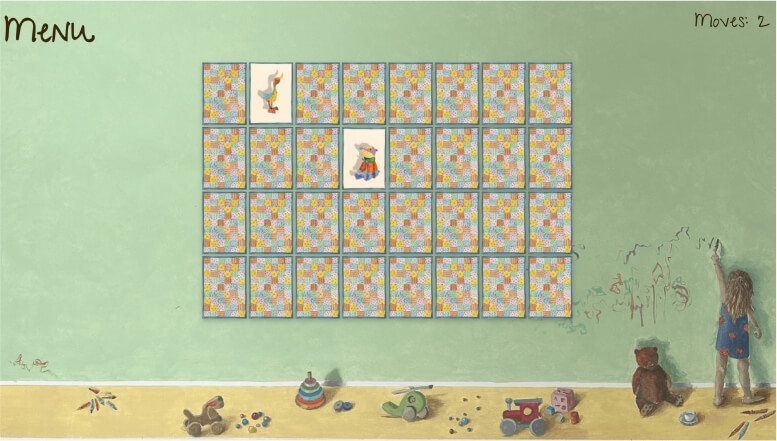

# Memory

## Table of contents

- [Overview](#overview)
- [Project Links](#links)
- [Development](#development)
- [What I Learned](#what-i-learned)
- [Issues](#issues)
- [To Do](#to-do)
- [Acknowledgments](#acknowledgments)
- [Author](#etienne-desfontaines)

## Overview

An illustrated version of the classic memory-card game - pairs. It focuses on using adorable illustrations and an engaging game screen to keep children happily engaged. The different difficulty options make it suitable for players of all ages.

### My Roles:

- Designer
- Copywriter
- Developer

### Links

- [Live site](https://pairs-concerntration-memory-game.netlify.app/)

## Development

I chose to build this project focusing predominantly on vanilla JS.
I made this choice as a learning exercise rather than because it is what I consider the most effective solution for this build. There are various functions and features that I recognize can be optimized through a different approach - such as using toggle classes and CSS selectors to show and hide the home screen buttons, and control the in-game menu opening and closing, rather than creating and removing elements from the DOM using JavaScript.

However, my previous build ([TwoAngels](https://github.com/etiennedesfontaines/TwoAngels)) was light on JS and heavy on HTML and CSS, so I decided it was most beneficial for my growth as a developer to utilize this project as an opportunity to challenge my JavaScript abilities instead.

### Technologies Used:

- HTML5
- CSS3
- Sass
- JavaScript

### My process

Task: Design and build a digital version of the card game "memory."

#### Mimimum Viable Product (MVP):

I began by outlining the minimum viable product, as seen below:

Instructions:

- Users will be provided with clear instructions on how to play the game, in case they are unfamiliar with the rules.

Gameplay:

- Users can choose from three difficulty levels: easy, medium, and hard. Each difficulty level influences the number of cards that will be dealt for the game. All card pairs must be unique.
- Once a difficulty is selected, the corresponding number of card pairs will be shuffled and dealt face down on the table.
- Users can select a card, and it will turn over, revealing its face image. The card cannot be selected again once revealed.
- Users can then select a second card, which will behave the same way as the first. They cannot select more than two cards simultaneously.
- If the selected cards do not match, they will turn face down again, and the user can try again.
- If a matching pair of cards is selected, they will remain face up and no longer selectable.
- Users continue selecting and matching cards until all pairs are matched, leading to a win.

End of Game:

- Upon completing the game, the user will receive congratulations, along with the number of turns it took to win. They will also be offered to play another game.
- If the user agrees to play again, they must re-select the difficulty level.
- If the user declines, they will be directed back to the home screen.
  In-Game Menu:

Options:

- Users can access an in-game menu that provides options to start a new game, read the instructions, or quit the current game.
- If the user selects "new game" or "quit game," a warning prompt will appear to confirm their choice, as selecting either option will terminate and lose the progress of the current game.
- While the in-game menu is open, the user cannot play the game (select and reveal cards). They can only do so once the menu is closed again.

#### MVP Pseudo Code:

I then broke the MVP down into pseudo code to help structure my thinking prior building:

- Home screen:

  - title
  - subtitle
  - buttons
    - Play Game: Shows select difficulty window
    - How to play: Shows how to play window

- How to play window

  - Description of how to play.
  - close screen button:
    - closes the how to play window.
    - re-renders home screen buttons.

- Select Difficulties window

  - Options of Easy, Medium, Hard buttons: Selecting starts a new game.
    - selects cards
    - double selection into pairs
    - shuffles cards
    - deals cards
  - close screen button:
    - closes the how to play window.
    - re-renders home screen buttons.

- inGame Screen

  - clickable cards (face down):

    - clicking card reveals card face (animation): subsequent clicks have no action.
    - clicking second card reveals card face (animation): subsequent clicks have no action.
    - Only two cards can be clicked per turn.
    - if cards match they remain face up and cannot be clicked. User can select new pair of cards.
    - if cards do not match, the remain face up for set amount of time then turn face down again (animation). User can now select new pair of cards.
    - if all cards are face up (matched), game ends - End of game screen rendered.

  - Turn counter:

    - increments by 1 for every two cards flipped.
    - resets to 0 on new game.

  - Menu: clicking pauses game and reveals menu options.
    - cards greyed out and non clickable.
    - moves counter greyed out
    - menu options:
      - new game: clicking reveals warning in menu bar: are you sure?
        - yes: game is ended, user is redirected to select difficulty screen.
        - no: warning is closed. User remains in menu.
      - how to play: clicking reveals how to play description in menu bar.
        - close button: clicking closes how to play desc and user remains in menu.
      - quit game
      - clicking reveals warning in menu bar: are you sure?
        - yes: game is ended, user is redirected to home screen.
      - no: warning is closed. User remains in menu.
    - close button: clicking closes menu option and resumes game.

- endOfGameScreen

  - congratulation message displayed
    - number of turns taken to complete game displayed.
    - new game option presented:
      - yes - renders select difficulty screen.
      - no - returns to home page.

- Game can only be played in landscape, irrespective of device.

#### Functionality

I approached this build by focusing on the game's functionality before concerning myself with any styling.

#### CSS styling

I used Sass partials to structure my styling. I started with mobile styling, working from top to bottom, and then proceeded to style for tablet and desktop, following the same workflow.

#### HTML

All HTML, except for the document's head and body tags, was generated and implemented using JavaScript.

## What I learned

### JavaScript

- DOM Manipulation: By generating and implementing HTML using JavaScript, I gained hands-on experience with manipulating the Document Object Model (DOM) to create, modify, and delete elements.
- Event Handling: I learned how to handle various events, such as click events, to add interactivity to the game.
- Asynchronous JavaScript: I added animations and timers to the game, using setTimeout.
- Dynamic Styling: Applying styles dynamically through JavaScript in order to create a responsive and visually appealing UI.
- Randomisation: Shuffling and dealing cards.

### CSS

- Modular Programming: Using Sass partials and variables to structure my styling.
- Animation: I practiced programatic animation, including using offsetHeight as a hack to trigger a reflow in the browser and allow reverse animation as a result. The offsetHeight is a read-only property that returns the height of the element, including the height of the padding, scrollbar, and border. When this property is accessed or read, it triggers a reflow in the browser. A reflow is a process in which the browser recalculates the layout of the document. It can be triggered by accessing certain layout-related properties, such as offsetHeight, offsetWidth, clientHeight, etc.

### Image Optimisation

Always optimise images in both dimension and file size.
Consider serving images based on device to allow mobile device images to be as small as possible.
Whenever possible, specify images sizes rather than using declarations of percentage or auto - this helps improve loading time, CLI and LCP.

### Other:

- Game Logic: Implementing the game's logic, such as card matching, shuffling, and dealing.
- Problem Solving: Creating various functions to manipulate the DOM, manage and track game play.

## Issues

- Moves counter causes layout shift on update.
  solutions tried:

  1. creating a pseudo element ::after, giving it content of 000, positioning it absolute and right 0. But the layout shift still occurs.
  2. Setting justify-self to start and adding a padding of 16rem to the left side of the element. It works but it does not allow for it to have a right side distance of 1.6rem from the page border, as it was designed to be, and as the menu on the opposite side of the screen is.
  3. I've tried using a parent container but cannot seem to resolve the issue even then...

- end of game screen needs to be redesigned.

- If connection is poor, images load slowly, revealing the face cards before the user has played. I think this likely has to do with the need for further image optimisation. Declaring difinitive height and width for the images, rather than using percentages and auto drastically improved the issue.

## To Do

### Beyond the MVP - To be added in later iterations:

- Game has music and sound effects that user can independently adjust by changing volume or muting and unmuting.
- If music is playing, music notes animate up from character on right hand side of background image.
- Cards animate from floor of background onto wall when a new game begins.
- Best score presented upon game completion: store in local memory.
- All copy is animated in as if being written
- When a new game is created - title, subtitle and difficulty menu fade or are erased before cards are dealt into the game.
- clickable elements shudder to show they can be interacted with.
- Consider lives: A limited amount of turns to try match all cards, dictated by difficulty and able to be turned on an off in settings.
- Game adapted to be more accessible - playable for users requiring assistive technology, namely voice readers and users who cannot use a mouse.

### Refactor:

- Remove unecessary repetition.
- Seperate game logic and logic responsible for DOM population. (gameLogic.js created)

## Acknowledgments

My Brothers, Emile and Bastien Desfontaines, both of whom were invaluable in guiding me and helping me successfully tackle the design and development challenges of this project. My sister Pascale Desfontaines, for illustrating both the game background and all the cards for me, without which this memory card game wouldn't be even half as appealing.

## Etienne Desfontaines

- [Website](https://etiennedesfontaines.com/)
- [Linkedin](https://www.linkedin.com/in/etienne-desfontaines-818349284/)
- [Frontend Mentor](https://www.frontendmentor.io/profile/etiennedesfontaines)
- [Exercism](https://exercism.io/profiles/etiennedesfontaines)
